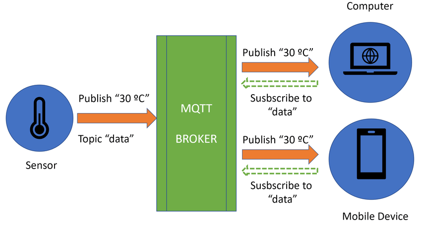

# A MQTT example for ESP32

If you want to use an appllication to test the MQTT service, i recommend you to use [MQTT Dashboard](https://play.google.com/store/apps/details?id=com.app.vetru.mqttdashboard).

Export App Data on [json](./mqtt-dashboard-data.json)...

## MQTT Workflow

## Author

- LearXD